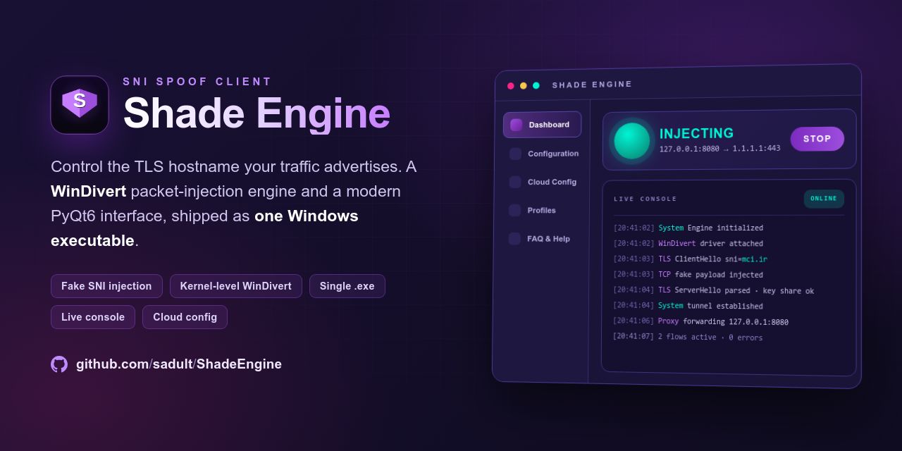

<div align="center">

<!-- LOGO PLACEHOLDER -->


# Shade Engine

**A modern Windows SNI Spoof client with a built-in packet-injection engine.**

[](#requirements)
[](#development-setup)
[](#interface-tour)
[](#how-it-works)
[](#building-the-windows-executable)



</div>

---

## Overview

**Shade Engine** is a Windows desktop client that performs **TLS SNI spoofing** at the packet level.

When a normal HTTPS connection starts, the client sends a TLS record called **ClientHello**. That record usually carries the **SNI extension** (`server_name`), a plaintext field that announces the hostname the client intends to reach. Because that field is not encrypted, it is the single most inspected value in modern TLS traffic.

Shade Engine puts that field under your control. It runs a local proxy listener, builds a crafted TLS ClientHello containing a **fake SNI** of your choice, and injects it through the WinDivert kernel driver while the actual TCP session is established against the **real destination IP and port** you configured.

The result is a client where three values are decoupled:

| Layer | Value controlled by |
| --- | --- |
| Local entry point | `LISTEN_HOST` + `LISTEN_PORT` |
| Advertised TLS hostname | `FAKE_SNI` |
| Real network destination | `CONNECT_IP` + `CONNECT_PORT` |

> **Scope statement.** Shade Engine is a research, diagnostics and education tool for networks you own or are explicitly authorized to test. See [Security and Responsible Use](#security-and-responsible-use).

---

## Feature Highlights

### Single-binary dual-mode design

The same executable serves two roles:

| Launch | Mode | Result |
| --- | --- | --- |
| `Shade Engine.exe` | GUI | Opens the desktop interface |
| `Shade Engine.exe --engine` | Engine | Runs the packet-injection backend |

When you press **Start**, the GUI spawns itself with the hidden `--engine` flag as a child process, hides the child console window on Windows, and pipes its output into the app.

### Packet-level injection through WinDivert

The backend uses `pydivert` (WinDivert bindings) to capture, craft and reinject TCP packets in the Windows network stack. This is why the packaged executable requests Administrator rights.

### TLS record engineering

The engine does not rely on a generic TLS library. It carries byte-accurate TLS 1.3 record templates and rebuilds them field by field:

- `ClientHello` construction with a substituted `server_name` extension and recalculated padding
- `ClientHello` parsing and round-trip validation
- `ServerHello` parsing and reconstruction
- Change Cipher Spec and Application Data framing

### Live console with debug mode

Every engine line is timestamped, colour-tagged and rendered in the in-app terminal. Debug mode toggles verbose backend output while still surfacing genuine `ERROR:` lines when debug is off.

### Fail-safe configuration handling

- `config.json` is created automatically with sane defaults if missing
- Every field is validated before saving (ports must be `1-65535`, host and SNI must be non-empty)
- Saving while the engine runs shows an explicit restart reminder
- A one-click **Reset to defaults** and **Copy** are available

---

## How It Works

### Step 1: The GUI starts and loads configuration

On launch, the app resolves the directory that holds the executable, ensures `config.json` exists, and renders the current values.

### Step 2: You press Start

The GUI launches a child process of itself in engine mode, with the working directory set to the folder containing `config.json`, and with the child console window suppressed.

### Step 3: The engine reads configuration and opens the local listener

The backend parses the five configuration keys, then binds a local proxy socket on `LISTEN_HOST:LISTEN_PORT`.

### Step 4: The WinDivert filter attaches

The engine opens a WinDivert handle with a filter scoped to the relevant TCP flows and begins receiving packets for inspection and modification.

### Step 5: A crafted ClientHello is injected

When a handshake begins, the engine builds a 517-byte TLS ClientHello from its template, substituting:

- 32 bytes of client random
- 32 bytes of session ID
- the `server_name` extension carrying your `FAKE_SNI`
- 32 bytes of key share
- recalculated padding so total length stays constant

### Step 6: The real session continues to your destination

The TCP connection itself is established against `CONNECT_IP:CONNECT_PORT`. Traffic is forwarded between your local client and the upstream endpoint while the engine keeps the injected handshake state consistent.

### Step 7: Everything is reported to the console

Status transitions, per-connection events and errors stream back into the GUI in real time.

---

## Requirements

### Runtime

| Requirement | Detail |
| --- | --- |
| Operating system | Windows 10 or Windows 11, 64-bit |
| Privileges | Administrator (WinDivert loads a kernel driver) |
| Driver | WinDivert, shipped with `pydivert` and bundled by the build |
| Extra runtime | None; the packaged build is self-contained |

Shade Engine is **Windows-only**. The backend depends on WinDivert, which has no Linux or macOS equivalent in this project.

### Development

| Requirement | Version |
| --- | --- |
| Python | 3.10 or newer |
| PyQt6 | 6.5.0 or newer |
| pydivert | 3.1.0 or newer |
| PyInstaller | 6.0.0 or newer |

---

## Installation

### Option A: Use a release build

1. Download and install `Shade-Installer.exe` from the repository releases.
2. Run it and approve the Administrator prompt.

### Option B: Run from source

```bash
git clone https://github.com/sadult/ShadeEngine.git
cd ShadeEngine
python -m venv .venv
.venv\Scripts\activate
pip install -r requirements.txt
python shade_engine.py
```

Run your terminal **as Administrator** when starting the engine from source.

---

## Quick Start

1. **Launch** Shade Engine and approve the elevation prompt.
2. Open **Configuration** and press **Edit**.
3. Set your values for `config.js`
4. Press **Save**.
5. Go to **Dashboard** and press **Start**. The status pulse turns green and the console badge switches to the active state.
6. Point your client to `127.0.0.1:8080` or `0.0.0.0:8080`.
7. Enable **Debug Mode** if you want verbose backend logs.
8. Press **Stop** to terminate the engine cleanly.

---

## Configuration Reference

Configuration lives in `config.json`, in the same folder as the executable.

```json
{
    "LISTEN_HOST": "0.0.0.0",
    "LISTEN_PORT": 40443,
    "FAKE_SNI": "auth.vercel.com",
    "CONNECT_IP": "188.114.98.0",
    "CONNECT_PORT": 443
}
```
**Validation rules enforced by the GUI**

- `LISTEN_HOST`, `FAKE_SNI` and `CONNECT_IP` cannot be empty
- `LISTEN_PORT` and `CONNECT_PORT` must be integers in `1-65535`
- Invalid input raises a themed warning dialog and the save is aborted

**Applying changes**

The backend reads configuration once at startup. After saving while the engine is running, press **Stop** then **Start**.

---

## Cloud Config

The **Cloud Config** entry in the sidebar, and the matching button on the Configuration page, open the canonical configuration reference hosted in this repository:

```text
https://github.com/sadult/ShadeEngine/blob/main/config.md
```

The raw form is also wired into the app constants for future in-app fetching:

```text
https://raw.githubusercontent.com/sadult/ShadeEngine/main/config.md
```

Because the app points at a file in the repository, you can publish new presets, endpoints and guidance by editing `config.md` and committing it. Users get the update instantly, with no new build.

---

## Local Profiles

**Local Profiles** opens `profiles.txt` next to the executable, creating it on first use. Use it as a personal scratchpad for v2ray/trojan configs.

The file is intentionally free-form and ignored by git.

---

## Logging and Debug Mode

The engine writes unbuffered, line-buffered output so the console updates in real time.

| Console element | Meaning |
| --- | --- |
| Offline badge | No engine process is running |
| Active badge | Engine attached and injecting |
| `System` lines | GUI-side events: config saved, process started, console cleared |
| Backend lines | Engine events, per-connection activity, WinDivert state |
| `ERROR:` lines | Always shown, even with debug mode disabled |

Use **Clear Logs** to reset the buffer, and **Debug Mode** to switch verbosity.

---

## Building the Windows Executable

From the project root, on Windows:

```bash
pyinstaller --noconfirm --clean ShadeEngine.spec
```

or simply:

```bat
build.bat
```

Output:

```text
dist/Shade Engine.exe
```

The spec file is configured to:

- collect the full `pydivert` package including `WinDivert.dll` and the driver `.sys` files
- bundle `config.json` and both icon assets
- hidden-import `gui`, `engine_core` and the PyQt6 modules
- exclude `tkinter`
- build a **one-file**, **windowed** executable with no console
- embed `version_info.txt` metadata and `assets/icon.ico`
- set `uac_admin=True` so Windows always prompts for elevation

---

## Development Setup

```bash
python -m venv .venv
.venv\Scripts\activate
pip install -r requirements.txt
```

Run the GUI:

```bash
python shade_engine.py
```

Run only the backend, for engine-side debugging:

```bash
python shade_engine.py --engine
```

Notes for contributors:

- `gui.py` must remain importable on any platform; keep Windows-only calls guarded.
- `engine_core.py` imports `pydivert` at module level and is expected to run only in the engine process.
- Any new widget must either sit inside a styled card or explicitly declare a transparent background, so the dark theme stays intact.

---

## Troubleshooting

### The engine will not start

- Confirm the app is running elevated. WinDivert cannot load its driver otherwise.
- Check that antivirus or endpoint protection is not blocking the WinDivert driver.
- Verify `config.json` exists beside the executable and contains valid JSON.
- Enable **Debug Mode** and read the first `ERROR:` line.

### `cannot read config.json`

The engine could not open or parse the file. Open **Configuration**, press **Edit**, then **Save** to regenerate a valid file.

### `config.json is missing or has invalid keys`

All five keys must be present with correct types. Use **Reset to defaults** and save.

### The port is already in use

Another process owns `LISTEN_PORT`. Pick a different local port or free the existing one.

### Configuration changes have no effect

Restart the engine. Configuration is only read at engine startup.

### The console looks empty

That is normal in quiet mode. Enable **Debug Mode** for verbose output.

### Connections fail

Check, in order:

1. `CONNECT_IP` is reachable from this machine
2. `CONNECT_PORT` is correct
3. `FAKE_SNI` is a syntactically valid hostname
4. Your client really points at `LISTEN_HOST:LISTEN_PORT`
5. No VPN or third-party filtering driver is competing for the same packets

### Windows SmartScreen warns about the executable

Unsigned binaries trigger that warning. Build from source yourself, or sign the executable with your own certificate.

---

## Performance Notes

- The engine uses `asyncio` for proxy forwarding and dedicated threads for injection timing, so throughput stays close to the raw connection minus driver overhead.
- TCP keepalive is tuned per socket with best-effort platform constants.
- The GUI never blocks on engine I/O; all output arrives through `QProcess` signals.
- Debug mode increases console volume significantly; keep it off for long sessions.

---

## Security and Responsible Use

Shade Engine operates at a low network layer, loads a kernel driver and rewrites packet contents. Treat it as a professional network tool.

**Acceptable use**

- Systems and networks you own or administer
- Environments where you have explicit written authorization to test
- Protocol research, TLS education, connectivity diagnostics, reproducible bug analysis

**Unacceptable use**

- Circumventing policies of networks you do not control
- Concealing malicious, abusive or unlawful traffic
- Attacking, overloading or defrauding any service
- Any activity that violates applicable law, contracts or terms of service

The authors and contributors provide this software **as is**, without warranty, and accept no liability for misuse. You are solely responsible for how you deploy it.

---

## Reporting Bugs

Open an issue here:

```text
https://github.com/sadult/ShadeEngine/issues
```

The in-app **Report a Bug** card and the FAQ **Report an Issue** button both link to that page.

Please include:

- Shade Engine version, shown in the sidebar and title bar
- Windows version and build number
- Whether the app was running as Administrator
- Your `config.json` with sensitive values redacted
- Console output with **Debug Mode** enabled
- Exact reproduction steps and the behaviour you expected

---

## Roadmap

- In-app fetching and one-click import of cloud presets from `config.md`
- Multiple saved profiles with instant switching from the Dashboard
- Per-connection statistics panel and throughput graph
- Optional log export to file
- Signed release builds

---

## Contributing

1. Fork the repository and create a feature branch.
2. Keep the dark theme contract: styled card or explicit transparent background.
3. Keep GUI and engine responsibilities separated.
4. Test both `python shade_engine.py` and a full PyInstaller build before opening a pull request.
5. Describe the behaviour change and include a screenshot for any UI work.

---

## FAQ

**What exactly is Shade Engine?**
A packet-manipulation client that spoofs the TLS SNI to improve connectivity with specific configurations on restricted networks.

**Why does it need Administrator rights?**
The WinDivert driver requires elevated privileges to capture and inject packets. The packaged build requests elevation automatically.

**Do I need a separate engine executable?**
No. The engine is embedded in the same binary and is started with an internal flag.

**Does it work on Linux or macOS?**
No. The backend is bound to WinDivert and therefore Windows-only.

**Is my traffic encrypted by Shade Engine?**
Shade Engine does not add encryption. It manipulates the handshake and forwards traffic; TLS security still comes from the endpoints involved.

**Can I use any hostname as the fake SNI?**
Any syntactically valid hostname is accepted. Whether it is useful depends entirely on the network you are testing.

---

<div align="center">

**Shade Engine** — precise SNI spoofing, one clean executable.

<!-- FOOTER BANNER PLACEHOLDER -->

</div>
